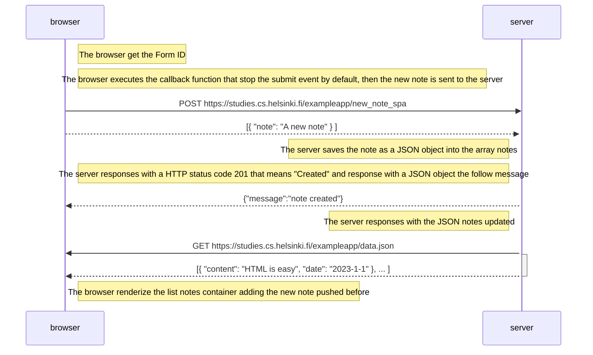

```mermaid
sequenceDiagram
    participant browser
    participant server

    Note right of browser: The browser get the Form ID

    Note right of browser: The browser executes the callback function that stop the submit event by default, then the new note is sent to the server

    browser->>server: POST https://studies.cs.helsinki.fi/exampleapp/new_note_spa
    activate server

    browser-->>server: [{ "note": "A new note" } ]

    Note left of server: The server saves the note as a JSON object into the array notes

    Note left of server:  The server responses with a HTTP status code 201 that means "Created" and response with a JSON object the follow message
    server-->>browser: {"message":"note created"}

    Note left of server:  The server responses with the JSON notes updated 
    server->>browser: GET https://studies.cs.helsinki.fi/exampleapp/data.json
    activate server
    server-->>browser: [{ "content": "HTML is easy", "date": "2023-1-1" }, ... ]
    deactivate server

    Note right of browser: The browser renderize the list notes container adding the new note pushed before
    
```
