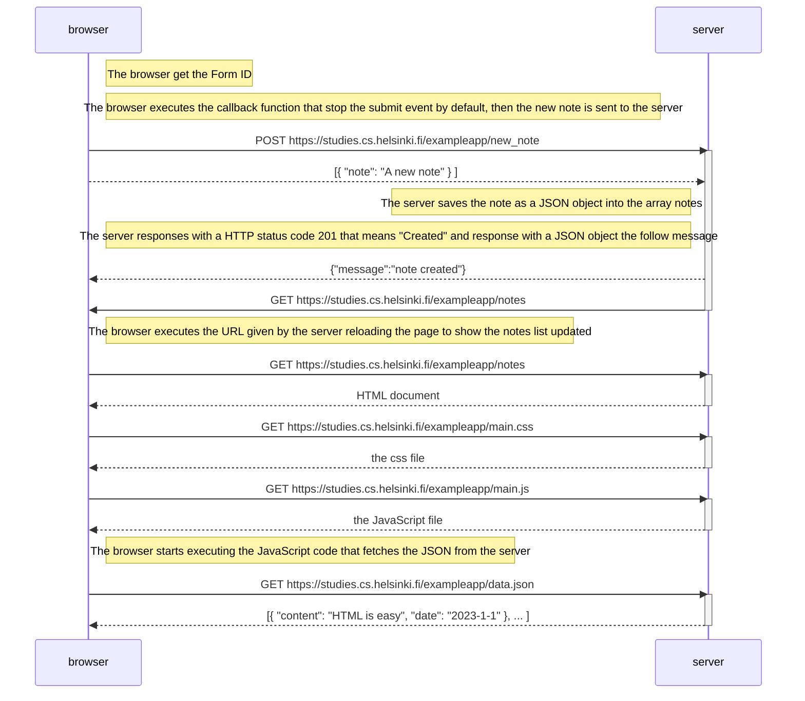

```mermaid
sequenceDiagram
    participant browser
    participant server

    Note right of browser: The browser get the Form ID

    Note right of browser: The browser executes the callback function that stop the submit event by default, then the new note is sent to the server

    browser->>server: POST https://studies.cs.helsinki.fi/exampleapp/new_note
    activate server

    browser-->>server: [{ "note": "A new note" } ]

    Note left of server: The server saves the note as a JSON object into the array notes

    Note left of server:  The server responses with a HTTP status code 201 that means "Created" and response with a JSON object the follow message

    server-->>browser: {"message":"note created"}

    server->>browser: GET https://studies.cs.helsinki.fi/exampleapp/notes
    deactivate server

    Note right of browser: The browser executes the URL given by the server reloading the page to show the notes list updated

    browser->>server: GET https://studies.cs.helsinki.fi/exampleapp/notes
    activate server
    server-->>browser: HTML document
    deactivate server

    browser->>server: GET https://studies.cs.helsinki.fi/exampleapp/main.css
    activate server
    server-->>browser: the css file
    deactivate server

    browser->>server: GET https://studies.cs.helsinki.fi/exampleapp/main.js
    activate server
    server-->>browser: the JavaScript file
    deactivate server

    Note right of browser: The browser starts executing the JavaScript code that fetches the JSON from the server

    browser->>server: GET https://studies.cs.helsinki.fi/exampleapp/data.json
    activate server
    server-->>browser: [{ "content": "HTML is easy", "date": "2023-1-1" }, ... ]
    deactivate server
```
